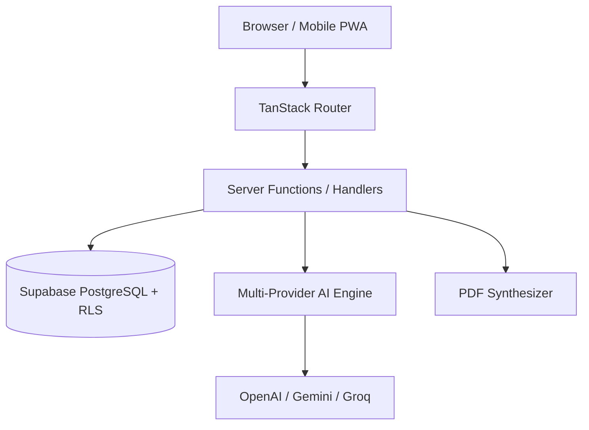

# Sanatan Dharma Suite (SanatanTools)

[](LICENSE)
[](#)
[](https://www.typescriptlang.org/)
[](https://react.dev/)
[](https://tanstack.com/start)
[](https://supabase.com)

**Sanatan Dharma Suite** is an enterprise-grade, full-stack Vedic astrology, Panchang, Kundli, AI-assisted astrological guidance, and spiritual wellness platform built using modern Web technologies.

---

## Table of Contents

- [Overview](#overview)
- [Key Features](#key-features)
- [Technology Stack](#technology-stack)
- [Folder Structure](#folder-structure)
- [Getting Started](#getting-started)
  - [Prerequisites](#prerequisites)
  - [Installation](#installation)
  - [Environment Variables](#environment-variables)
  - [Database Setup](#database-setup)
  - [Running Locally](#running-locally)
- [Build & Deployment Commands](#build--deployment-commands)
- [System Architecture](#system-architecture)
- [Screenshots & UI Mockups](#screenshots--ui-mockups)
- [Roadmap](#roadmap)
- [Contributing](#contributing)
- [Security](#security)
- [License](#license)
- [Support & Credits](#support--credits)

---

## Overview

Sanatan Dharma Suite provides high-precision astronomical and Vedic calculations based on Swetest astronomical engines and traditional Hindu Siddhantas. It offers comprehensive Janam Kundli generation, Guna Milan matching, daily/weekly/monthly/yearly horoscopes, muhurat discovery, festival calendars, Vastu consultations, numerology reports, AI-driven astrological synthesis, and downloadable PDF reports.

---

## Key Features

- 📜 **Precision Janam Kundli**: Accurate birth chart rendering, planetary positions, Dasha timelines, divisional charts (D9, D10, etc.), and Yogas.
- 💑 **Kundli Matching (Ashtakoota)**: 36-point Guna Milan, Nadi Dosha, Manglik Dosha, and detailed compatibility analysis.
- 📅 **Hindu Panchang & Festivals**: High-precision Tithi, Nakshatra, Yoga, Karana, Rahu Kalam, Choghadiya, and festival dates.
- 🤖 **Multi-Provider AI System**: Dual/fallback AI integration supporting OpenAI, Google Gemini, Groq, DeepSeek, and OpenRouter with automatic provider fallback and prompt version control.
- 📄 **PDF Report Engine**: Instant server-side and client-side PDF generation for Kundli, Panchang, and Vedic astrology consultations.
- 🌐 **Multilingual (i18n)**: Native multi-language support (English, Hindi, Sanskrit, and regional Indian languages) with dictionary management and automated queueing.
- 📊 **First-Party Analytics**: Self-hosted privacy-focused analytics engine with GDPR-compliant SHA-256 IP anonymization, GA4 integration, and enterprise BI exports (CSV, Excel XML, Printable PDF, JSON).
- 🛡️ **Enterprise Admin Panel**: 27+ administration modules covering user moderation, monetization, payment gateways, ad management, content CMS, AI studio, and audit logging.

---

## Technology Stack

- **Framework**: TanStack React Start, TanStack Router, React 19
- **Build Tool**: Vite 8, TypeScript 5.8
- **Styling**: TailwindCSS 4, Radix UI Primitives, Lucide Icons, Sonner Toasts
- **Database & Auth**: Supabase (PostgreSQL, Row Level Security, Auth Services)
- **Calculations**: Astronomy Engine, Swetest JS / Astronomical Algorithms
- **AI Integrations**: Vercel AI SDK, OpenAI API, Google Gemini API, Groq, OpenRouter, DeepSeek
- **PDF Rendering**: jsPDF & HTML Print Document Synthesizer
- **Testing**: Vitest, Custom Node E2E Verification Suites

---

## Folder Structure

```text
Sanatan Dharma Suite (1)/
├── .env.example              # Environment variables template
├── .gitignore                # Git ignore rules
├── CHANGELOG.md              # Semantic release changelog
├── CONTRIBUTING.md           # Developer contribution guide
├── LICENSE                   # MIT License
├── README.md                 # Project README
├── SECURITY.md               # Security policy & disclosure
├── docs/                     # Full technical documentation suite
│   ├── AdminPanel.md
│   ├── AI.md
│   ├── Analytics.md
│   ├── Architecture.md
│   ├── Database.md
│   ├── Deployment.md
│   ├── Notifications.md
│   ├── PDF.md
│   ├── SEO.md
│   └── Translations.md
├── public/                   # Static assets, manifests, and icons
├── reports/                  # Health & readiness audit reports
├── scripts/                  # Automated verification & seed scripts
├── src/
│   ├── components/           # UI components, layout, and admin modules
│   │   ├── admin/
│   │   ├── analytics/
│   │   ├── horoscope/
│   │   ├── kundli/
│   │   ├── ui/
│   │   └── tools/
│   ├── integrations/         # Supabase client & server middleware
│   ├── lib/                  # Core algorithms, analytics, AI, and i18n
│   ├── routes/               # File-based TanStack Start routes
│   ├── styles.css            # Global CSS & Tailwind styling
│   └── start.ts              # TanStack Start entry point
└── supabase/                 # Database migrations and seed configs
```

---

## Getting Started

### Prerequisites

- **Node.js**: `v20.0.0` or higher (Recommended: `v24.x`)
- **npm** or **pnpm**
- **Supabase Account**: A running Supabase project with environment keys

### Installation

1. **Clone the repository:**

   ```bash
   git clone https://github.com/your-org/sanatan-dharma-suite.git
   cd sanatan-dharma-suite
   ```

2. **Install dependencies:**
   ```bash
   npm install
   ```

### Environment Variables

Copy `.env.example` to `.env` and fill in your Supabase and API key credentials:

```bash
cp .env.example .env
```

Key environment variables:

```env
NEXT_PUBLIC_SUPABASE_URL="https://your-project.supabase.co"
NEXT_PUBLIC_SUPABASE_ANON_KEY="your-anon-key"
SUPABASE_SERVICE_ROLE_KEY="your-service-role-key"
OPENAI_API_KEY="sk-..."
GEMINI_API_KEY="AIza..."
```

### Database Setup

Run the admin database seed script to populate default settings, plans, and AI configurations:

```bash
node --env-file=.env scripts/seed-admin-defaults.js
```

### Running Locally

Start the local development server:

```bash
npm run dev
```

Open `http://localhost:3000` in your browser.

---

## Build & Deployment Commands

- **Local Development**: `npm run dev`
- **Build Production Bundle**: `npm run build`
- **Preview Production Build**: `npm run preview`
- **Run Unit Tests**: `npx vitest run`
- **Verify Admin & Analytics Systems**: `node --env-file=.env scripts/verify-admin-panel.js`

---

## System Architecture

The application uses a hybrid server-side / client-side rendering model powered by TanStack React Start and Vite.



---

## Screenshots & UI Mockups

|    Homepage & Panchang     |     Janam Kundli Chart     |    Admin Control Panel     |
| :------------------------: | :------------------------: | :------------------------: |
| _(Screenshot Placeholder)_ | _(Screenshot Placeholder)_ | _(Screenshot Placeholder)_ |

---

## Roadmap

- [x] Phase 1: Core Vedic Astrological Calculation Engine
- [x] Phase 2: Panchang, Horoscope & Festival Modules
- [x] Phase 3: AI Provider System & Prompt Studio
- [x] Phase 4: Multi-Channel Notifications & Email System
- [x] Phase 5: PDF Export & Report Engine
- [x] Phase 6: Privacy-Focused Analytics Platform
- [x] Phase 7: Comprehensive End-to-End System Testing
- [x] Phase 8: GitHub Standardization & Technical Documentation
- [ ] Phase 9: Mobile Native Apps (React Native / Capacitor)
- [ ] Phase 10: Live Astrologer Video Consultations

---

## Contributing

We welcome community contributions! Please read our [CONTRIBUTING.md](CONTRIBUTING.md) guide for information on code standards, branch conventions, and pull request checklists.

---

## Security

Security vulnerabilities should be reported responsibly. Please read our [SECURITY.md](SECURITY.md) policy for disclosure guidelines and response SLAs.

---

## License

Distributed under the MIT License. See [LICENSE](LICENSE) for details.

---

## Support & Credits

Developed with devotion by the Sanatan Dharma Engineering Team. Built using open-source tools including Astronomical Engine, React, TanStack Start, TailwindCSS, and Supabase.

For inquiries or enterprise support, reach out to `support@sanatantools.org`.
