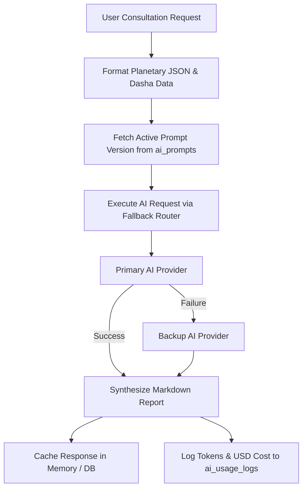

# Multi-Provider AI System Architecture

## Overview

Sanatan Dharma Suite incorporates an enterprise-grade, multi-provider AI engine designed for astrological report synthesis, horoscope interpretations, and spiritual Q&A.

---

## 1. Supported AI Providers & Models

| Provider Name     | Type / Endpoint       | Supported Models                                          | Primary Use Case                          |
| :---------------- | :-------------------- | :-------------------------------------------------------- | :---------------------------------------- |
| **OpenAI**        | OpenAI Compatible API | `gpt-4o`, `gpt-4o-mini`                                   | Complex Kundli synthesis & Career Reports |
| **Google Gemini** | Google AI SDK         | `gemini-1.5-pro`, `gemini-1.5-flash`, `gemini-2.0`        | High-volume horoscope interpretations     |
| **Groq**          | Groq OpenAI API       | `llama-3.3-70b-versatile`, `mixtral-8x7b-32768`           | Low-latency instant Q&A                   |
| **DeepSeek**      | DeepSeek API          | `deepseek-chat`, `deepseek-reasoner`                      | Deep logical Vedic reasoning              |
| **OpenRouter**    | OpenRouter Gateway    | `anthropic/claude-3.5-sonnet`, `meta-llama/llama-3.3-70b` | Fallback gateway                          |

---

## 2. Prompt Flow Architecture



---

## 3. Fallback Logic & Resilience

- **Primary Provider**: Selected based on provider priority order in `ai_providers` table.
- **Failover Trigger**: Triggered automatically on HTTP `429` (Rate Limit Exceeded), `500` (Internal Server Error), or timeout (>10s).
- **Secondary Provider**: Requests automatically route to the next enabled provider without user intervention.

---

## 4. Cost & Token Tracking

Every AI completion inserts a usage record into `ai_usage_logs`:

```json
{
  "provider_name": "openai",
  "model_name": "gpt-4o",
  "feature_key": "career_report",
  "input_tokens": 850,
  "output_tokens": 420,
  "total_tokens": 1270,
  "latency_ms": 1420,
  "cost_estimate": 0.00425,
  "success": true
}
```

---

## 5. Verification

Verify AI providers programmatically:

```bash
node --env-file=.env scripts/verify-ai-system.js
```
