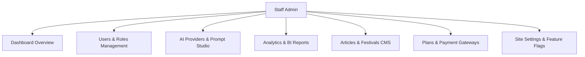

# Admin Panel Architecture & Management Guide

## Overview

The Admin Panel in Sanatan Dharma Suite provides comprehensive administrative control over users, CMS content, monetization, AI providers, analytics BI, and system health. All admin routes are located under `src/routes/_authenticated/_admin.*.tsx` and protected by staff authentication middleware (`is_staff`).

---

## Admin Modules & Features Reference



### 1. Dashboard Overview (`/admin/`)

- KPI snapshot cards (Users, Active Sessions, Pageviews, AI Requests, Revenue, Bounce Rate).
- Real-time online user tracker and top pages breakdown.

### 2. Users & Moderation (`/admin/users`)

- User table search, profile inspection, role assignment (`staff`, `admin`, `user`).
- Moderation actions, user device history, and activity logs.

### 3. Roles & Permissions

- Security definer RPC checks (`is_staff`, `has_role`).
- Role-gated server functions protecting analytics and system controls.

### 4. Site Settings (`/admin/settings`)

- Dynamic site variables: App Title, Logo URL, Default Language, Maintenance Mode toggle.
- Stored in `site_settings` table.

### 5. AI Providers & Models (`/admin/ai-providers`)

- Multi-provider manager for OpenAI, Gemini, Groq, DeepSeek, and OpenRouter.
- Priority ordering, model selection, temperature tuning, and fallback sequencing.

### 6. Prompt Manager / AI Studio (`/admin/ai-studio`)

- System prompt editor, feature key mapping (`kundli_interpretation`, `career_report`, `vastu_analysis`), and version history logs.

### 7. Analytics & BI (`/admin/analytics`, `/admin/performance`)

- Real-time pageviews, device/browser breakdowns, Core Web Vitals (LCP, INP, CLS, TTFB, FCP), slow page detection, and JS exception logs.

### 8. SEO & Redirects (`/admin/seo`)

- Canonical URL rules, 301/302 URL redirect manager, and sitemap settings.

### 9. Languages & i18n (`/admin/translations`)

- Multilingual dictionary key editor, translation queue, and automated AI translation trigger.

### 10. Payments & Monetization (`/admin/monetization`, `/admin/payment-gateways`)

- Subscription tier plan editor (`subscription_plans`), coupon codes, and payment gateway keys (Razorpay, Stripe, LemonSqueezy).

### 11. Email Templates (`/admin/emails`)

- HTML template builder for welcome emails, order receipts, and password resets using React Email.

### 12. Notification Templates (`/admin/notifications`)

- Multi-channel notification queue inspector and template editor for Web Push, SMS, and Email.

### 13. Feature Flags (`/admin/tools`)

- Feature toggles for individual astrological tools and PDF export tools.

---

## Admin Module Verification

Run programmatic verification of all admin panel CRUD modules:

```bash
node --env-file=.env scripts/verify-admin-panel.js
```
