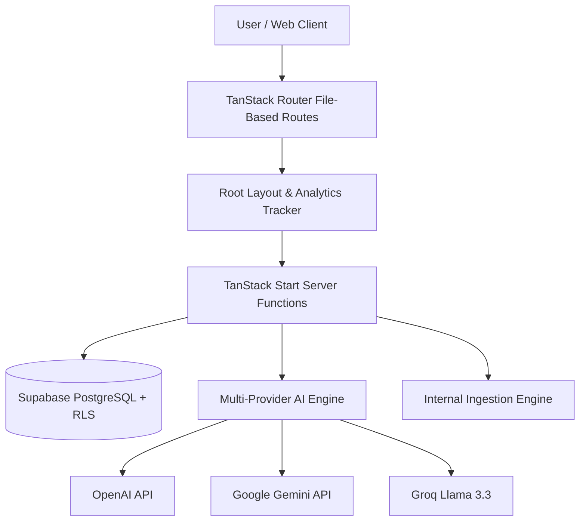
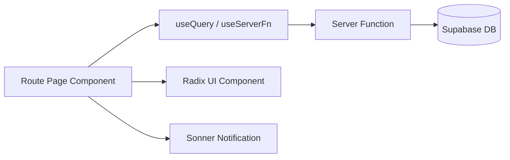
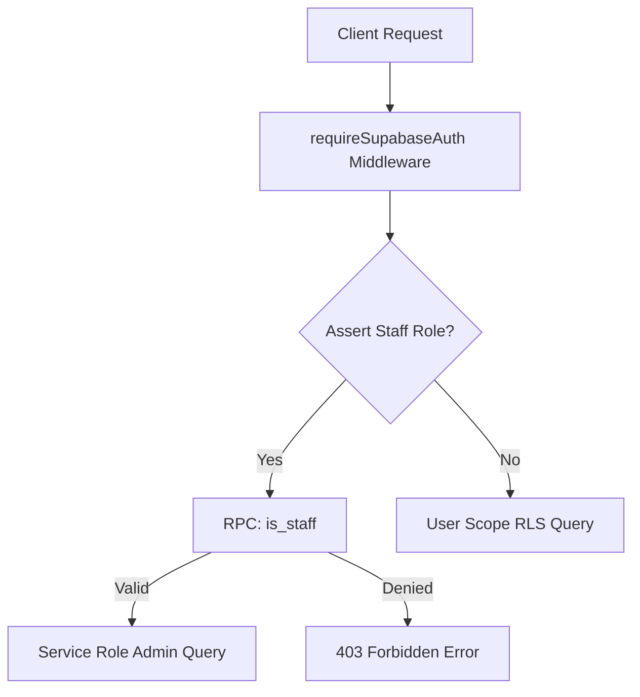
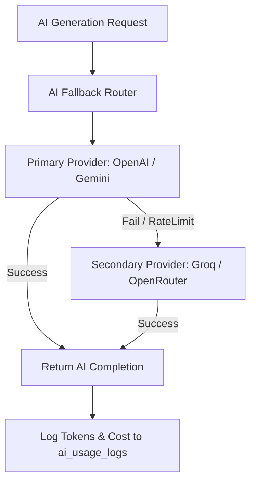

# Technical Architecture Guide

## Overview

Sanatan Dharma Suite is built on a modern, full-stack architecture leveraging **TanStack React Start**, **TanStack Router**, **Vite 8**, and **Supabase (PostgreSQL + Auth)**. It combines server-side rendering (SSR), server functions, and interactive client hydration for high-performance astrological computations.

---

## 1. System Architecture Overview



---

## 2. Frontend Architecture

- **Framework**: TanStack React Start (SSR + Client Hydration).
- **Routing**: File-based routes located in `src/routes/`. Authenticated & admin routes are guarded under `src/routes/_authenticated/`.
- **State Management**: TanStack React Query handles server state caching and optimistic updates.
- **UI & Layout Kit**: TailwindCSS 4, Radix UI primitives, Lucide React icons, and Sonner toast notifications.



---

## 3. Backend & Data Architecture

- **Database**: PostgreSQL hosted on Supabase.
- **Row Level Security (RLS)**: Enforces table policies by user ownership (`auth.uid() = user_id`) and staff authorization (`is_staff`).
- **Server Functions**: Type-safe handlers (`createServerFn`) executing with authenticated Supabase context.



---

## 4. Multi-Provider AI Architecture



---

## 5. Folder Structure Reference

```text
src/
├── components/          # Reusable UI components & feature modules
│   ├── admin/           # Admin panel screens & CRUD drivers
│   ├── analytics/       # Script injection & tracker components
│   ├── horoscope/       # Horoscope card rendering
│   ├── kundli/          # Birth chart rendering & Dasha tables
│   ├── ui/              # Radix UI primitives
│   └── tools/           # Individual Vedic tool modules
├── integrations/        # Supabase client initialization & auth middleware
├── lib/                 # Core server functions & algorithms
│   ├── analytics/       # Analytics engine, validators, export helpers
│   ├── notifications/   # Email, SMS & WebPush delivery engines
│   └── ai/              # Multi-provider AI SDK glue
├── routes/              # TanStack Start file-based routing tree
└── styles.css           # Global CSS & design system tokens
```
