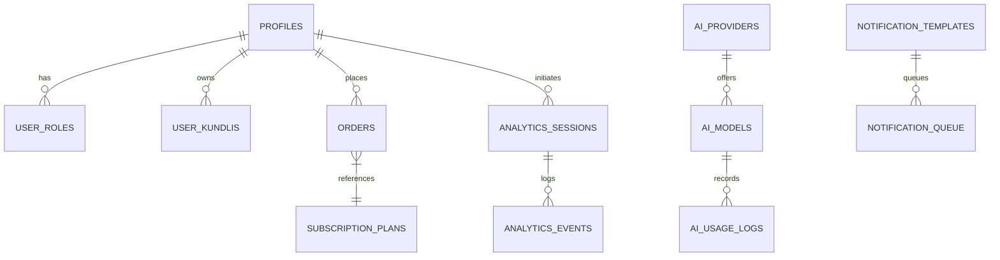

# Database & Schema Architecture Guide

## Overview

Sanatan Dharma Suite uses **PostgreSQL** hosted on **Supabase**. All data access is governed by Row Level Security (RLS) policies and security definer functions.

---

## Entity Relationship (ER) Diagram



---

## Core Database Tables Reference

| Table Name           | Key Columns                                              | RLS Policy                        | Notes                           |
| :------------------- | :------------------------------------------------------- | :-------------------------------- | :------------------------------ |
| `profiles`           | `id`, `display_name`, `avatar_url`, `created_at`         | User read/write own               | Primary user profile record     |
| `user_roles`         | `user_id`, `role`, `created_at`                          | Staff read/write                  | Roles: `admin`, `staff`, `user` |
| `user_kundlis`       | `id`, `user_id`, `name`, `dob`, `tob`, `lat`, `lng`      | User read/write own               | Stored Janam Kundli charts      |
| `analytics_events`   | `id`, `event_name`, `session_id`, `user_id`, `meta`      | Service role insert, staff select | Ingested tracking events        |
| `analytics_sessions` | `session_id`, `started_at`, `device`, `country`, `pages` | Service role insert/update        | User session metrics            |
| `ai_usage_logs`      | `id`, `model_name`, `total_tokens`, `cost_estimate`      | Staff select                      | Token consumption audit         |
| `ai_providers`       | `id`, `provider_type`, `enabled`, `priority`             | Staff write, public select        | Configured AI backends          |
| `ai_prompts`         | `id`, `feature_key`, `system_prompt`, `enabled`          | Staff write                       | Versioned AI prompt studio      |
| `orders`             | `id`, `user_id`, `plan_id`, `amount_cents`, `status`     | User select own, staff select all | Paid orders and subscriptions   |
| `subscription_plans` | `id`, `name`, `slug`, `price_cents`, `active`            | Public select active              | Subscription pricing tiers      |
| `admin_festivals`    | `id`, `name`, `slug`, `category`, `published`            | Public select published           | Festival master calendar        |
| `audit_logs`         | `id`, `actor_user_id`, `action`, `resource_type`, `meta` | Staff insert/select               | System audit trail              |

---

## Key Stored Procedures & Security Definers

### 1. `is_staff(_user_id UUID)`

```sql
CREATE OR REPLACE FUNCTION public.is_staff(_user_id UUID)
RETURNS BOOLEAN AS $$
BEGIN
  RETURN EXISTS (
    SELECT 1 FROM public.user_roles
    WHERE user_id = _user_id AND role IN ('staff', 'admin')
  );
END;
$$ LANGUAGE plpgsql SECURITY DEFINER;
```

---

## Database Seeding

Initialize database defaults and default plans:

```bash
node --env-file=.env scripts/seed-admin-defaults.js
```
