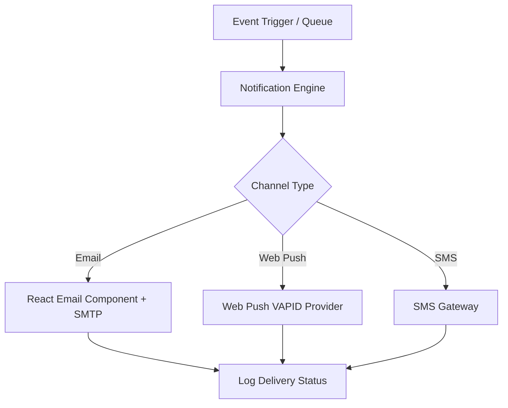

# Notification System Architecture

## Overview

The Notification System manages automated email delivery, Web Push notifications, and SMS messages across user lifecycle events (registration, purchase receipts, daily horoscope alerts).

---

## 1. Notification Architecture

---

## 2. Notification Templates

- Built using React Email (`@react-email/components`).
- Configurable in `notification_templates` database table.
