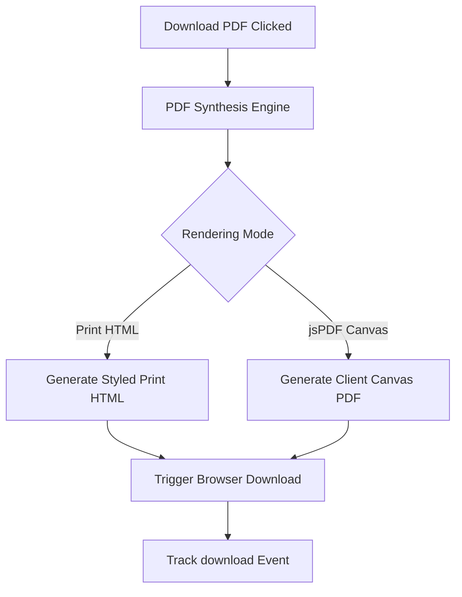

# PDF Synthesis & Export Engine Guide

## Overview

The PDF Report Engine provides high-quality PDF rendering for Janam Kundli charts, Panchang printouts, and AI-narrated astrological reports.

---

## 1. PDF Rendering Architecture

---

## 2. Supported PDF Templates & Charts

- **Janam Kundli Birth Report**: Includes North/South Indian chart SVG, Lagna, D9 Navamsa, D10 Dasamsa, planetary details, and Vimshottari Dasha table.
- **Match Making Compatibility Report**: Ashtakoota 36-point breakdown, Manglik Dosha status, and recommendation.
- **Panchang Daily Summary**: Tithi, Nakshatra, Yoga, Karana, and Choghadiya table.
- **AI Career & Horoscope Report**: AI-generated interpretation paragraphs with professional branding headers.

---

## 3. Custom Branding & Fonts

- Professional typography styling utilizing system serif fonts for print elegance.
- Custom header and footer watermark with Sanatan Dharma Suite branding logo.
