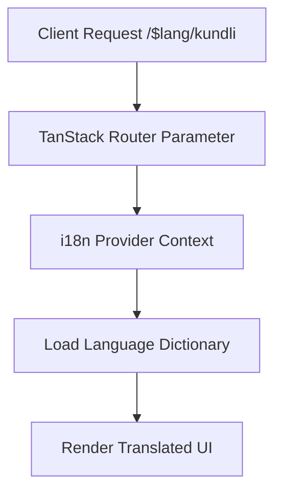

# Internationalization (i18n) & Translation System

## Overview

Sanatan Dharma Suite supports native multi-language localization (English, Hindi, Sanskrit, and regional languages) with dynamic key translation, language-prefixed routing (`/$lang/...`), and automated translation queueing.

---

## 1. i18n Architecture

---

## 2. Translation Queue & Workflow

- Missing dictionary keys log automatically to `translation_queue` table.
- Admin panel queue allows staff to batch translate missing keys using configured AI providers.
