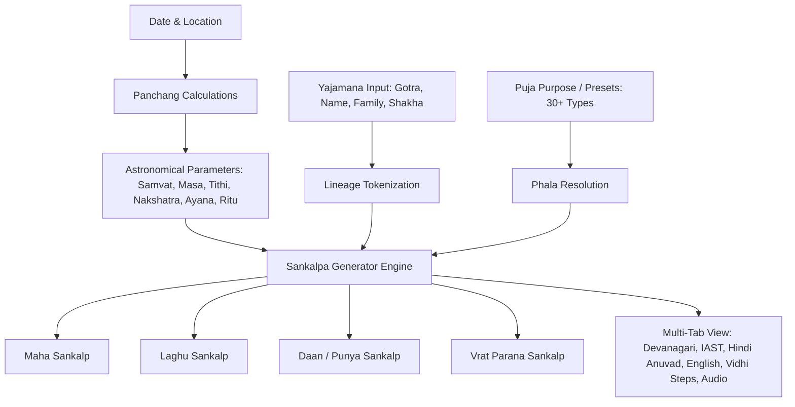

# Vedic Sankalp Engine Documentation

## 1. Overview
The **Vedic Sankalp Engine** (`src/components/tools/sankalp/sankalp-engine.ts`) is a high-precision Sanskrit ritual generator built on traditional Shastriya frameworks (*Bodhayana*, *Parasari*, and *Smarta* traditions). It deterministically computes the complete **Desha-Kala-Patra** (Cosmic Geography, Astronomical Time, Host Lineage, and Ritual Resolution) for any date and location.

---

## 2. Core Architecture

---

## 3. Calculation & Astronomical Logic

### 3.1 Cosmological Chronology (Desha-Kala)
The engine constructs the traditional cosmography:
- **Kalpa & Manvantara**: *Śrī-Śveta-Vārāha-Kalpe*, *Vaivasvata-Manvantare*, *28th Kaliyuga (1st Charana)*.
- **Geography**: *Jambūdvīpe*, *Bhāratavarṣe*, *Bharatakhaṇḍe*, *Āryāvartāika-deśe*, followed by the exact city or pilgrimage locus (*Kṣetre/Nagare*).
- **Samvatsara**: Computed via the 60-year Jovian Samvatsara cycle based on the active Vikram and Shaka Samvatsaras.
- **Ephemerides**: Real-time Tithi, Nakshatra, Yoga, Karana, and Moon Sign derived via sidereal ephemerides.

### 3.2 Host Lineage Modes (Patra)
- **Individual (`self`)**: `${gotra}गोत्रोत्पन्नः ${name}शर्मा/वर्मा (अहम्)`
- **With Spouse (`spouse`)**: `${gotra}गोत्रोत्पन्नः ${name}शर्मा मम धर्मपत्नी ${spouseName}सहितः सपत्नीकोऽहम्`
- **Family (`family`)**: `${gotra}गोत्रोत्पन्नः ${name}शर्मा सभार्यापुत्रपौत्रबन्धुबान्धवपरिवारसहितः`
- **On Behalf (`behalf`)**: Representative resolution for proxy worship.

---

## 4. Supported Sankalpa Modes
1. **Maha Sankalp (महासंकल्प)**: Complete classical Vedic Shastriya format suitable for major Pujas, Havans, Griha Pravesh, and Navratri.
2. **Laghu Sankalp (लघु संकल्प)**: Concise daily form for Nitya Puja and Sandhyavandanam.
3. **Daan Sankalp (दान एवं पुण्य संकल्प)**: Ritual formulation for charity, Anna-daan, and Dakshina.
4. **Vrat Parana Sankalp (व्रत पारण संकल्प)**: For breaking sacred vows and concluding fasts.

---

## 5. UI Features & Capabilities
- **Live Ephemeris Sync**: Auto-computes current Panchang parameters for selected city and date.
- **Multi-Script Outputs**: Devanagari (with bold highlights), IAST Roman, Line-by-line Hindi Anuvad, and English translation.
- **Audio Chanting Guide**: Web Speech API integration for Sanskrit pronunciation assistance.
- **Step-by-Step Vidhi Guide**: Interactive 5-step ritual protocol (Purification, Holding holy ingredients, Recitation, Offering to Ishanya direction).
- **Printable Sankalpa Patra**: Dedicated printer styles and PDF export format.
